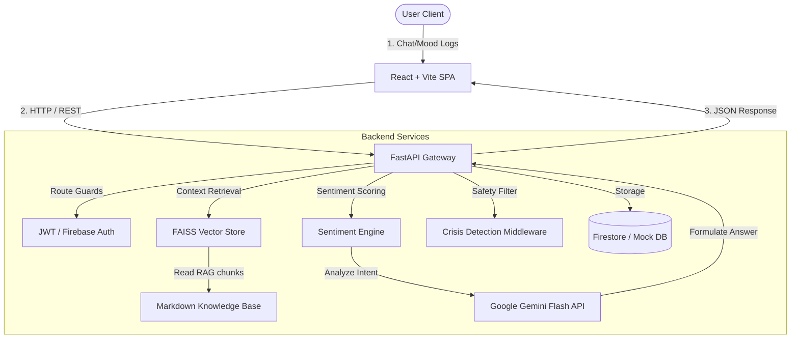

# 🧠 MindCareAI — AI-Powered Mental Health Companion

[](https://opensource.org/licenses/MIT)
[](https://www.python.org/)
[](https://nodejs.org/)
[](https://react.dev/)
[](https://fastapi.tiangolo.com/)
[](https://github.com/facebookresearch/faiss)

MindCareAI is a complete, production-grade, AI-powered mental health companion. Combining **Cognitive Behavioral Therapy (CBT)** frameworks, **Retrieval-Augmented Generation (RAG)**, and advanced sentiment mapping, MindCareAI offers empathetic support, automatic emotion tracking, grounding exercises, and safety guardrails.

Built on a decoupled **FastAPI backend** and a glassmorphic **React + Vite frontend**, the application is fully optimized for containerized deployments and cloud platforms.

---

## 🌟 Key Features

*   **💬 Empathetic AI Companion:** Multi-turn conversational chatbot utilizing Google's Gemini Flash model, primed to respond with active listening, validation, and CBT-derived interventions.
*   **📊 Emotional Sentiment Analysis:** Automatic post-message analysis that monitors conversations for signs of Anxiety, Stress, Loneliness, Depression, Anger, and Happiness, plotting intensities from 1–10.
*   **🩺 Evidenced-Based CBT RAG Pipeline:** Retrieves localized stress-relief methods and therapeutic exercises from a local markdown knowledge base using `sentence-transformers` and a **FAISS** vector store.
*   **🧘 Panic-Response Grounding Buddy:** Interactive guidance dashboard with a custom breathing pacer and a 5-4-3-2-1 sensory observation checklist.
*   **🛡️ Hardened Crisis Guardrails:** Immediate local regex triggers capture self-harm or suicidal keywords, instantly delivering local crisis hotlines and resources, bypassing LLM generation for maximum safety.
*   **📈 Mood Tracker & Analytics:** Log daily emotions and view longitudinal trends on a dashboard visualization, complete with automated wellness tips.
*   **✨ Premium Glassmorphic UI:** A beautiful, responsive interface featuring light/dark theme options, responsive drawer layout, and smooth CSS transitions.

---

## 🏗️ System Architecture



---

## 📁 Repository Directory Structure

```
MindCareAI/
├── backend/                      # FastAPI Python service
│   ├── app/                      # Main API application code
│   │   ├── api/                  # Authentication & system routes
│   │   ├── auth/                 # JWT validation utilities
│   │   ├── database/             # Database repository pattern (Firestore & Mock DB)
│   │   ├── middleware/           # CORS, rate limiting, and exception overrides
│   │   ├── models/               # Pydantic schemas for data validation
│   │   ├── routes/               # API endpoint handlers
│   │   ├── services/             # Gemini AI & RAG service orchestration
│   │   └── utils/                # Loggers, cleaners, and regex-based guardrails
│   ├── knowledge_base/           # Markdown-based CBT & mindfulness articles
│   ├── scripts/                  # Script to compile & build the FAISS vector database
│   ├── Dockerfile                # Production container deployment settings
│   └── requirements.txt          # Python packages list
│
├── frontend/                     # React Single Page App (SPA)
│   ├── src/                      # Source components, pages, hooks, and services
│   │   ├── components/           # UI elements (Grounding widgets, protected layouts)
│   │   ├── context/              # Dark theme & user authentication providers
│   │   ├── pages/                # Analytics, Chat, Dashboard, Profile, Crisis, Landing
│   │   └── services/             # Frontend API client endpoints (Axios wrapper)
│   ├── package.json              # Node dependencies & package configuration
│   └── tailwind.config.js        # Tailwind layout parameters
│
├── docs/                         # Additional documentation
│   ├── SETUP.md                  # Comprehensive local configuration guide
│   ├── DEPLOYMENT.md             # Hugging Face & Vercel deployment tutorial
│   └── API_REFERENCE.md          # Complete REST API specifications
│
└── .gitignore                    # Git file exclusion rules
```

---

## 🛠️ Getting Started

To spin up the project locally in under 5 minutes:

### 1. Backend Server Setup
```bash
cd backend
python -m venv venv
# Windows (PowerShell)
.\venv\Scripts\Activate.ps1
# Mac / Linux
source venv/bin/activate

pip install -r requirements.txt
cp .env.example .env
python app/main.py
```
> **Note:** The backend has a built-in Mock Mode. If `GOOGLE_API_KEY` is not provided, it will generate simulated empathetic responses, letting you run the application offline immediately!

### 2. Frontend client Setup
```bash
cd frontend
npm install
npm run dev
```
Open **`http://localhost:5173`** in your browser to sign up, log a mood, and interact with the companion.

For instructions on configuring a real **Firebase Cloud Store** database and generating a **Google Gemini API Key**, see [docs/SETUP.md](file:///C:/Users/ramiz/.gemini/antigravity/scratch/MindCareAI/docs/SETUP.md).

---

## 🚀 Cloud Deployment

MindCareAI is pre-configured to deploy easily to production environments:

*   **Backend (FastAPI):** Designed for containerized hosting. A complete guide on deploying the backend container to **Hugging Face Spaces** is available in [docs/DEPLOYMENT.md](file:///C:/Users/ramiz/.gemini/antigravity/scratch/MindCareAI/docs/DEPLOYMENT.md).
*   **Frontend (React/Vite):** Optimized for serverless edge hosting. Deploy to **Vercel** with automatic deployment previews in [docs/DEPLOYMENT.md](file:///C:/Users/ramiz/.gemini/antigravity/scratch/MindCareAI/docs/DEPLOYMENT.md).

---

## ⚠️ Important Disclaimer

**MindCareAI is an AI educational and companion prototype.** It is **not** a clinical diagnostic tool, medical treatment service, or replacement for human professional therapy. 

If you or someone you know is experiencing a mental health crisis or thinking of self-harm, please seek professional support immediately or navigate directly to the **Crisis Resources page (`/emergency`)** in the application to access emergency contact details.
